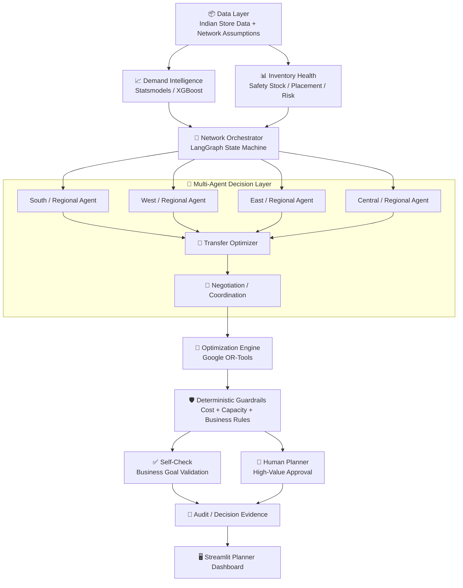
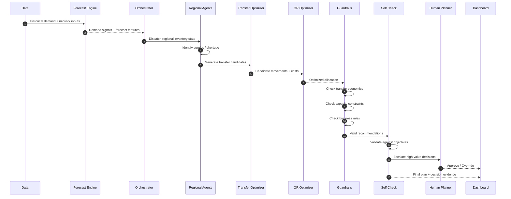

Absolutely. I checked **your actual repository**, not just the text you pasted. Your repo already has a strong engineering footprint: `src/agents`, forecasting/optimization modules, benchmark scripts, integration stubs, tests, Docker assets, documentation, presentation material, configuration, and the Streamlit UI. ([GitHub][1])

I also deliberately removed claims that could hurt credibility—especially calling it “Top 1%,” vague “real-time” claims, and exposing internal chain-of-thought. The README below is written to make a reviewer understand **the problem → the decision engine → the mathematics → the agent layer → the benchmark → the demo → the engineering quality** in a few minutes.

This is the **copy-paste-ready final `README.md`** for your repository.

# 🚀 NetworkIQ — Multi-Agent Inventory Placement & Network Optimization

### AI-assisted inventory decisions for India's multi-echelon retail & quick-commerce networks

> **Where should inventory sit? When should it move? And is moving it actually worth the money?**
>
> **NetworkIQ answers all three — using demand forecasting, multi-agent coordination, deterministic optimization, financial guardrails, and human approval.**

[](https://www.python.org/)
[](https://developers.google.com/optimization)
[](https://www.langchain.com/langgraph)
[](https://streamlit.io/)
[](https://pytest.org/)
[](LICENSE)

**Repository:** [https://github.com/krishnamohan-vadlapatla/network_iq](https://github.com/krishnamohan-vadlapatla/network_iq)

---

## 🧠 The One-Line Idea

**NetworkIQ turns inventory placement from a siloed forecasting problem into a network-level decision problem.**

Instead of asking:

> “How much stock should this store order?”

NetworkIQ asks:

> **“Across the entire network, where should this unit of inventory be positioned to maximize service and economic value — while respecting demand, capacity, transfer cost, and business constraints?”**

That distinction is the core of the system.

---

# 🎯 Why This Problem Matters

Indian retail and quick-commerce networks increasingly operate through a hybrid fulfillment structure:

```text
                    SUPPLY NETWORK

                         ┌───────────────┐
                         │ Mother /      │
                         │ Regional WH   │
                         └───────┬───────┘
                                 │
                    ┌────────────┼────────────┐
                    ▼            ▼            ▼
               ┌────────┐   ┌────────┐   ┌────────┐
               │ City   │   │ City   │   │ City   │
               │ FC     │   │ FC     │   │ FC     │
               └───┬────┘   └───┬────┘   └───┬────┘
                   │             │             │
              ┌────┴────┐   ┌────┴────┐   ┌────┴────┐
              ▼         ▼   ▼         ▼   ▼         ▼
           Dark      Dark  Dark      Dark  Dark      Dark
           Store     Store Store     Store Store     Store
```

The resulting challenge is not simply **forecasting demand**.

It is **placing scarce inventory at the right node at the right time**.

### The Misplacement Paradox

A network can simultaneously have:

* **Stockout risk** at a high-velocity dark store.
* **Excess inventory** sitting in a distant warehouse.
* **Expensive shelf capacity** occupied by slow movers.
* **Transfer opportunities** that look attractive until freight cost is considered.
* **Capacity constraints** that make an apparently optimal movement physically impossible.
* **Demand uncertainty** that makes naive replenishment dangerous.

A local optimizer can improve one node while making the network worse.

**NetworkIQ therefore optimizes the network, not the silo.**

---

# 💡 What NetworkIQ Does

NetworkIQ combines four decision layers:

| Layer                         | Question                                         | Technology                                           |
| ----------------------------- | ------------------------------------------------ | ---------------------------------------------------- |
| 📈 Demand Intelligence        | What will customers need?                        | Statistical forecasting + XGBoost                    |
| 📦 Inventory Intelligence     | Where is stock healthy or at risk?               | Safety stock, placement logic, inventory diagnostics |
| 🤖 Multi-Agent Coordination   | Which nodes should negotiate inventory movement? | LangGraph agent orchestration                        |
| 🧮 Deterministic Optimization | What movement maximizes network value?           | Google OR-Tools optimization                         |
| 🛡️ Governance                | Should the recommendation actually be allowed?   | Cost, capacity, approval & self-check guardrails     |

The important design principle is:

> **LLMs and agents propose and coordinate. Deterministic mathematics decides what is financially and physically valid.**

---

# 🏆 The Core Differentiator

Most “AI inventory” systems stop at:

```text
Historical Sales
      ↓
Demand Forecast
      ↓
Recommended Quantity
```

NetworkIQ goes further:

```text
Historical Demand
       │
       ▼
┌──────────────────────┐
│ Demand Forecasting   │
│ + Uncertainty        │
└──────────┬───────────┘
           │
           ▼
┌──────────────────────┐
│ Inventory Health     │
│ + Safety Stock       │
│ + Placement Need     │
└──────────┬───────────┘
           │
           ▼
┌──────────────────────┐
│ Regional Agents      │
│ Detect Surplus/Need  │
└──────────┬───────────┘
           │
           ▼
┌──────────────────────┐
│ Transfer Candidates  │
│ + Cost + Lead Time   │
└──────────┬───────────┘
           │
           ▼
┌──────────────────────┐
│ OR Optimization      │
│ Global Allocation    │
└──────────┬───────────┘
           │
           ▼
┌──────────────────────┐
│ Guardrail Engine     │
│ Profit + Capacity    │
│ + Risk + Approval    │
└──────────┬───────────┘
           │
       ┌───┴────┐
       ▼        ▼
    Reject    Planner
               Review
                  │
                  ▼
            Approved Plan
```

This makes NetworkIQ a **decision system**, rather than merely a chatbot wrapped around inventory data.

---

# 🏗️ System Architecture



---

# 🔄 End-to-End Decision Flow



---

# 🧮 The Decision Funnel

Every transfer recommendation passes through a strict sequence.

## 1. Is there demand?

A transfer should not happen simply because another node has less stock.

The destination must have a defensible demand requirement.

NetworkIQ uses historical demand signals and forecasting components to estimate future need.

---

## 2. Is the destination physically capable?

A mathematically attractive movement is useless if the destination cannot physically hold the inventory.

NetworkIQ models operational constraints such as:

* Available capacity
* Inventory quantity
* SKU characteristics
* Lead time
* Node restrictions
* Network assumptions

---

## 3. Is the movement economically justified?

The central financial guardrail is:

```text
Transfer Cost < Economic Value Unlocked
```

If shipping inventory costs more than the value recovered from avoiding the shortage / unlocking the sale, the recommendation is rejected.

This prevents the classic failure mode of optimization systems:

> **“The algorithm found a way to move inventory, therefore we moved it.”**

NetworkIQ instead asks:

> **“Should we pay to move it?”**

---

# 🛡️ Deterministic Guardrails

The most important architectural rule in NetworkIQ is:

> **Probabilistic AI must never be the final authority over deterministic business constraints.**

The system separates:

### AI / Agent Responsibilities

* Forecast
* Detect patterns
* Prioritize decisions
* Generate candidate actions
* Coordinate regional decisions
* Produce planner-facing explanations

### Deterministic Responsibilities

* Cost calculations
* Capacity calculations
* Transfer feasibility
* ROI checks
* Constraint validation
* Final acceptance / rejection rules

This gives the system a safer architecture:

```text
                 AI PROPOSES
                     │
                     ▼
             ┌───────────────┐
             │ Deterministic │
             │ Guardrails    │
             └───────┬───────┘
                     │
             ┌───────┴────────┐
             ▼                ▼
          REJECT            ACCEPT
                               │
                               ▼
                        Planner Review
```

---

# 🤖 Multi-Agent Design

NetworkIQ avoids the brittle “single mega-prompt” approach.

Instead, responsibility is decomposed into specialized components.

| Component              | Responsibility                                      |
| ---------------------- | --------------------------------------------------- |
| 🎯 Orchestrator        | Controls global execution state                     |
| 🏭 Regional Agents     | Reason over localized inventory conditions          |
| 📈 Demand Forecaster   | Generates demand signals                            |
| 📦 Placement Optimizer | Determines inventory positioning requirements       |
| 🔄 Transfer Optimizer  | Generates economically relevant movement candidates |
| 🤝 Negotiation Layer   | Resolves competing inventory requirements           |
| 🧮 Optimization Engine | Solves constrained allocation                       |
| 🛡️ Guardrail Engine   | Rejects invalid / uneconomic actions                |
| ✅ Self-Check           | Validates final plan against objectives             |
| 📝 Audit Module        | Records decision evidence                           |
| 👤 Planner Workflow    | Handles human approval for high-impact actions      |

### Why multiple agents?

Because the network itself is distributed.

A South region does not need to reason over every operational detail in the North.

The architecture therefore follows:

```text
Local State
    ↓
Local Reasoning
    ↓
Candidate Actions
    ↓
Network Coordination
    ↓
Global Optimization
    ↓
Business Guardrails
```

This creates a cleaner separation of concerns and provides a natural path toward distributed execution.

---

# ⚡ Tiered Intelligence

Not every SKU deserves expensive reasoning.

NetworkIQ follows a **compute-to-value** philosophy.

### A-Class — High Impact

High-value / high-velocity decisions receive deeper reasoning and optimization.

```text
A-Class
  ↓
Forecast + Agent Reasoning
  ↓
Network Optimization
  ↓
Guardrails
  ↓
Planner Review when required
```

### B-Class — Medium Impact

Use statistical / ML-driven decisions where appropriate.

### C-Class — Long Tail

Use inexpensive deterministic rules and heuristics.

```text
C-Class
  ↓
Rules / Heuristics
  ↓
Fast Decision
```

The objective is simple:

> **Spend computation where the business value justifies it.**

---

# 📊 Optimization Objective

At a high level, NetworkIQ treats inventory placement as a constrained network optimization problem.

The decision variables represent inventory allocation and/or transfer quantities between nodes.

The optimization seeks to balance:

```text
                    Network Value
                         │
        ┌────────────────┼────────────────┐
        ▼                ▼                ▼
   Lost Sales        Holding Cost     Transfer Cost
        │                │                │
        └────────────────┼────────────────┘
                         │
                         ▼
                 Global Objective
```

Conceptually:

```text
Maximize:

    recovered margin
    - transfer cost
    - inventory holding cost
    - shortage / service penalties

subject to:

    inventory conservation
    node capacity
    transfer feasibility
    business constraints
    non-negative quantities
```

The exact implementation is contained in the optimization modules under `src/`.

---

# 📈 Forecasting Layer

The repository includes a dedicated demand forecasting module using the project's statistical and ML dependencies.

Current forecasting stack includes:

* `statsmodels`
* `XGBoost`
* `scikit-learn`
* `pandas`
* `numpy`

The forecasting layer is intentionally separated from optimization.

That means:

```text
Forecasting ≠ Optimization
```

A forecast answers:

> **“What might happen?”**

Optimization answers:

> **“Given what might happen, what should we do?”**

That separation is critical for building an explainable planning system.

---

# 🧪 Benchmarking: AI vs Classical Optimization

A strong inventory system cannot simply claim:

> “AI is better.”

It needs a baseline.

NetworkIQ therefore includes a benchmark path comparing the intelligent decision flow against a classical optimization / baseline approach.

Run:

```bash
python scripts/run_benchmark.py
```

The benchmark is designed to evaluate decision quality under simulated inventory conditions and demand shocks.

The important question is not whether an agent sounds intelligent.

It is whether the resulting inventory decisions improve business outcomes.

---

# 🧩 Repository Structure

The repository is intentionally organized as an engineering project rather than a single notebook.

```text
network_iq/
│
├── data/
│   ├── indian_store_data.csv
│   └── assumptions.md
│
├── docs/
│   ├── ai_workflow.md
│   ├── architecture_diagram.md
│   ├── architecture_diagram.svg
│   └── cost_model.md
│
├── docker/
│   ├── Dockerfile
│   └── docker-compose.yml
│
├── notebooks/
│   └── ...
│
├── presentation/
│   ├── demo_script.md
│   └── slides.md
│
├── scripts/
│   ├── generate_sample_data.py
│   ├── run_benchmark.py
│   └── run_optimizer.py
│
├── src/
│   ├── agents/
│   ├── benchmarks/
│   ├── integration/
│   ├── audit_module.py
│   ├── baseline_solver.py
│   ├── data_loader.py
│   ├── demand_forecasting.py
│   ├── placement_optimizer.py
│   ├── self_check.py
│   └── transfer_optimizer.py
│
├── tests/
│   ├── test_agents.py
│   ├── test_baseline_solver.py
│   ├── test_data_loader.py
│   ├── test_demand_forecasting.py
│   ├── test_integration.py
│   └── test_self_check.py
│
├── ui/
│   ├── components/
│   └── streamlit_app.py
│
├── .env.example
├── config.yaml
├── deliverable_summary.md
├── requirements.txt
├── LICENSE
└── README.md
```

The current repository structure includes dedicated modules for agents, benchmarks, integrations, forecasting, optimization, audit/self-check logic, tests, Docker assets, documentation, and the Streamlit interface. ([GitHub][1])

---

# 🖥️ Planner Dashboard

NetworkIQ includes a Streamlit-based planner interface.

The dashboard is designed around a **Human-in-the-Loop** operating model.

The planner should be able to answer:

```text
What is the recommendation?
        ↓
Why was it generated?
        ↓
What demand supports it?
        ↓
What will it cost?
        ↓
What value does it unlock?
        ↓
Does it violate any constraint?
        ↓
Should I approve it?
```

This is particularly important for high-value inventory movements where fully autonomous execution may not be appropriate.

Launch the interface with:

```bash
streamlit run ui/streamlit_app.py
```

---

# 👤 Human-in-the-Loop Governance

NetworkIQ is designed around **decision augmentation**, not blind automation.

High-impact recommendations can be routed through a planner approval workflow.

```text
                    Recommendation
                           │
                           ▼
                    Guardrail Check
                           │
                  ┌────────┴────────┐
                  │                 │
               Low Risk          High Value
                  │                 │
                  ▼                 ▼
             Auto-eligible       Planner Queue
                                    │
                              ┌─────┴─────┐
                              ▼           ▼
                           Approve      Override
```

This allows automation to handle repetitive decisions while preserving human control over financially material actions.

---

# 🔍 Explainability & Auditability

A recommendation is only useful if a planner can understand it.

NetworkIQ therefore treats decision evidence as a first-class concern.

A transfer should be explainable in terms of:

* Destination demand
* Current inventory position
* Expected shortage / surplus
* Proposed quantity
* Transfer cost
* Economic value unlocked
* Capacity feasibility
* Business-rule validation
* Approval status

### Important design choice

NetworkIQ does **not** rely on exposing hidden model reasoning or private chain-of-thought.

Instead, the system should expose **structured decision evidence**:

```text
DECISION
──────────────
Source:          Node A
Destination:     Node B
SKU:             SKU-XXXX
Quantity:        120 units

DEMAND
──────────────
Expected demand: ...
Safety stock:    ...
Projected gap:   ...

ECONOMICS
──────────────
Transfer cost:   ₹...
Value unlocked:  ₹...
Decision:        PASS

CONSTRAINTS
──────────────
Capacity:        PASS
Quantity:        PASS
Business rules:  PASS

GOVERNANCE
──────────────
Approval required: YES / NO
```

That is much more useful to an enterprise planner than a raw LLM transcript.

---

# 🔌 Integration-Ready Architecture

The repository contains an `integration/` layer intended to isolate external system connectivity from the decision engine. ([GitHub][2])

A production deployment can connect NetworkIQ to:

```text
             ┌─────────────────┐
             │ WMS / Inventory │
             └────────┬────────┘
                      │
                      ▼
               ┌─────────────┐
               │ NetworkIQ   │
               │ Decision    │
               │ Engine      │
               └──────┬──────┘
                      │
            ┌─────────┴─────────┐
            ▼                   ▼
      ┌───────────┐       ┌───────────┐
      │ TMS /     │       │ Planner   │
      │ Transfers │       │ Approval  │
      └───────────┘       └───────────┘
```

The architecture therefore separates:

**data acquisition → decisioning → governance → execution**

rather than tightly coupling them.

---

# 🧱 Engineering Principles

## 1. Never Let the LLM Do Deterministic Arithmetic

Profitability, capacity and feasibility belong in deterministic code.

LLMs can assist with reasoning.

They should not be trusted to calculate whether:

```text
₹18,420 - ₹7,850 = ₹10,570
```

when the business consequence is a real inventory movement.

---

## 2. Forecasting and Optimization Are Different Problems

A forecast is uncertain.

An optimization decision is constrained.

Keeping these layers separate allows each to be tested independently.

---

## 3. Optimize the Network, Not the Node

Local optimization can create global inefficiency.

NetworkIQ explicitly introduces cross-node coordination and global constraints.

---

## 4. Cost of Intelligence Must Be Justified

A recommendation system should not spend more computational value than it creates.

Hence:

```text
High-value decision → deeper reasoning
Low-value decision  → cheaper reasoning
```

---

## 5. Humans Remain in Control of High-Impact Decisions

Automation should reduce planner workload without eliminating governance.

---

# 🧪 Testing

NetworkIQ includes a dedicated test suite covering core components such as:

* Agent behavior
* Baseline optimization
* Data loading
* Demand forecasting
* Integration behavior
* Self-check logic

Run:

```bash
pytest
```

For coverage:

```bash
pytest --cov
```

The repository contains the corresponding test modules under `tests/`. ([GitHub][3])

---

# 📦 Tech Stack

| Area                | Technology                         |
| ------------------- | ---------------------------------- |
| Language            | Python                             |
| Data                | Pandas, NumPy                      |
| Forecasting         | Statsmodels, XGBoost, Scikit-learn |
| Optimization        | Google OR-Tools                    |
| Agent Orchestration | LangGraph, LangChain Core          |
| LLM Provider        | Google Generative AI               |
| UI                  | Streamlit                          |
| Visualization       | Plotly, Matplotlib                 |
| Testing             | Pytest, Pytest-Cov                 |
| Configuration       | YAML / dotenv                      |
| Deployment          | Docker / Docker Compose            |

These dependencies are reflected directly in the repository's `requirements.txt`. ([GitHub][4])

---

# 🚀 Getting Started

## Prerequisites

Recommended:

* Python 3.10+
* Git
* Optional: Docker

---

## 1. Clone the Repository

```bash
git clone https://github.com/krishnamohan-vadlapatla/network_iq.git
cd network_iq
```

---

## 2. Create a Virtual Environment

### Windows

```bash
python -m venv venv
.\venv\Scripts\Activate.ps1
```

### macOS / Linux

```bash
python -m venv venv
source venv/bin/activate
```

---

## 3. Install Dependencies

```bash
pip install --upgrade pip
pip install -r requirements.txt
```

The repository currently declares its data, forecasting, optimization, agent, UI and testing dependencies in `requirements.txt`. ([GitHub][4])

---

# ⚡ Run the Optimizer

```bash
python scripts/run_optimizer.py
```

---

# 📊 Run the Benchmark

```bash
python scripts/run_benchmark.py
```

This provides the fastest way to inspect the optimization / baseline behavior.

---

# 🖥️ Launch the Planner Dashboard

```bash
streamlit run ui/streamlit_app.py
```

Then open:

```text
http://localhost:8501
```

---

# 🧪 Run Tests

```bash
pytest
```

---

# 🐳 Docker

Docker assets are included in:

```text
docker/
├── Dockerfile
└── docker-compose.yml
```

Build and run with:

```bash
docker compose -f docker/docker-compose.yml up --build
```

The Docker setup is intentionally kept separate from the application source so local development and containerized execution can evolve independently. ([GitHub][5])

---

# 📚 Data

The repository contains the working data layer under:

```text
data/
├── indian_store_data.csv
└── assumptions.md
```

The data assumptions are explicitly documented rather than hidden inside model code. ([GitHub][6])

This distinction matters because inventory optimization is only as trustworthy as the assumptions behind:

* Demand
* Margin
* Capacity
* Transfer cost
* Lead time
* Inventory state

---

# 📐 From Prototype to Production

The current implementation is deliberately structured so that a simulation / hackathon MVP can evolve toward a production decision platform.

## Current

```text
CSV / Simulated Network
        ↓
Forecasting
        ↓
Agent Coordination
        ↓
Optimization
        ↓
Guardrails
        ↓
Planner UI
```

## Production Evolution

```text
WMS / OMS / ERP / TMS
        │
        ▼
Event Streaming
        │
        ▼
Feature / Demand Layer
        │
        ▼
Distributed Agent Runtime
        │
        ▼
Network Optimization
        │
        ▼
Policy + Guardrails
        │
        ▼
Human Approval
        │
        ▼
Execution Systems
```

Potential scale-out technologies include event streaming, distributed execution, container orchestration and lakehouse infrastructure.

These are **production evolution paths**, not claims that every component is already deployed in the current MVP.

---

# 🗺️ Roadmap

## Phase 1 — Decision Engine

* [x] Demand forecasting layer
* [x] Inventory placement logic
* [x] Transfer optimization
* [x] Baseline solver
* [x] Agent architecture
* [x] Guardrail / self-check modules
* [x] Benchmark workflow
* [x] Planner dashboard
* [x] Automated tests
* [x] Docker assets
* [x] Architecture & cost documentation

## Phase 2 — Enterprise Integration

* [ ] Production WMS integration
* [ ] Production TMS integration
* [ ] Streaming inventory events
* [ ] Real-time route / freight pricing
* [ ] Production identity & authorization
* [ ] Persistent decision ledger
* [ ] Approval workflow persistence

## Phase 3 — Network Scale

* [ ] Distributed agent execution
* [ ] Event-driven re-optimization
* [ ] Large-scale feature store
* [ ] Continuous model evaluation
* [ ] Multi-network optimization
* [ ] Production observability

---

# 🎯 What Success Looks Like

NetworkIQ is designed to optimize three business outcomes simultaneously.

### 1. Better Availability

Put high-velocity inventory closer to demand.

```text
Stockout Risk ↓
In-Stock Rate ↑
Customer Experience ↑
```

### 2. Lower Network Cost

Avoid unnecessary transfers and excessive inventory.

```text
Holding Cost ↓
Freight Waste ↓
Dead Stock ↓
```

### 3. Better Capital Allocation

Inventory is capital.

The goal is not:

> “Keep every location full.”

The goal is:

> **“Put the right inventory at the right node at the right time.”**

---

# 🧠 Why This Is More Than an LLM Demo

A useful enterprise AI system cannot be:

```text
Prompt
  ↓
LLM
  ↓
Answer
```

NetworkIQ instead follows:

```text
DATA
 ↓
FORECAST
 ↓
STATE
 ↓
AGENTS
 ↓
CANDIDATES
 ↓
OPTIMIZATION
 ↓
GUARDRAILS
 ↓
SELF-CHECK
 ↓
HUMAN GOVERNANCE
 ↓
DECISION
```

This architecture deliberately combines:

**AI for uncertainty + agents for coordination + operations research for optimization + deterministic code for safety.**

That combination is the foundation of NetworkIQ.

---

# 🔬 Key Design Insight

Inventory optimization is fundamentally a **systems problem**.

Demand forecasting alone cannot solve it.

An optimizer alone cannot solve it.

An LLM alone cannot solve it.

A planner alone cannot solve it at network scale.

NetworkIQ combines them:

```text
                 NETWORKIQ
                     │
       ┌─────────────┼─────────────┐
       │             │             │
       ▼             ▼             ▼
   PREDICT        OPTIMIZE      GOVERN
       │             │             │
       │             │             │
   ML / Stats     OR-Tools     Guardrails
       │             │             │
       └─────────────┼─────────────┘
                     │
                     ▼
              MULTI-AGENT
               COORDINATION
                     │
                     ▼
             HUMAN DECISION
                     │
                     ▼
             BUSINESS ACTION
```

**The result is not “AI that talks about inventory.”**

**It is an architecture for making inventory decisions.**

---

# 📖 Documentation

The repository includes dedicated technical documentation covering:

* AI workflow
* Architecture
* Cost model
* Architecture diagrams
* Demo flow
* Presentation material

See:

```text
docs/
presentation/
deliverable_summary.md
```

The repository also contains a dedicated deliverable summary for hackathon evaluation. ([GitHub][7])

---

# 🏁 Quick Demo Path

If you are evaluating NetworkIQ for the first time:

### Step 1 — Install

```bash
pip install -r requirements.txt
```

### Step 2 — Run the optimizer

```bash
python scripts/run_optimizer.py
```

### Step 3 — Run the benchmark

```bash
python scripts/run_benchmark.py
```

### Step 4 — Open the planner UI

```bash
streamlit run ui/streamlit_app.py
```

### Step 5 — Inspect the implementation

Start with:

```text
src/demand_forecasting.py
src/placement_optimizer.py
src/transfer_optimizer.py
src/baseline_solver.py
src/self_check.py
src/audit_module.py
src/agents/
```

This path takes a reviewer from **business problem → mathematical engine → agent layer → validation → interface** without requiring them to understand the entire repository first.

---

# ⚖️ Responsible AI & Operational Safety

NetworkIQ is designed around a simple principle:

> **Automation should increase decision quality, not remove accountability.**

Therefore:

* Forecasts remain probabilistic.
* Optimization remains deterministic where possible.
* Business constraints are enforced outside the LLM.
* High-impact decisions can require human approval.
* Assumptions are documented.
* Baselines are retained for comparison.
* Tests cover core modules.
* Production integrations are treated separately from the MVP.

This makes the architecture suitable for progressively increasing autonomy without assuming that an AI model is infallible.

---

# 👨‍💻 Project

**NetworkIQ — Multi-Agent Inventory Placement & Network Optimization**

Built for the challenge of making complex Indian retail fulfillment networks more **responsive, economical, explainable, and scalable**.

### Core Thesis

> **Don't optimize each warehouse independently. Optimize the inventory network as a whole.**

---

## 📄 License

This project is licensed under the **MIT License**. See [`LICENSE`](LICENSE) for details.

---

<div align="center">

### NetworkIQ

**Predict demand. Position inventory. Optimize movement. Protect margin. Keep humans in control.**

**Built for the future of intelligent retail fulfillment.**

</div>

[1]: https://github.com/krishnamohan-vadlapatla/network_iq "GitHub - krishnamohan-vadlapatla/network_iq · GitHub"
[2]: https://github.com/krishnamohan-vadlapatla/network_iq/tree/main/src "network_iq/src at main · krishnamohan-vadlapatla/network_iq · GitHub"
[3]: https://github.com/krishnamohan-vadlapatla/network_iq/tree/main/tests "network_iq/tests at main · krishnamohan-vadlapatla/network_iq · GitHub"
[4]: https://github.com/krishnamohan-vadlapatla/network_iq/blob/main/requirements.txt "network_iq/requirements.txt at main · krishnamohan-vadlapatla/network_iq · GitHub"
[5]: https://github.com/krishnamohan-vadlapatla/network_iq/tree/main/docker "network_iq/docker at main · krishnamohan-vadlapatla/network_iq · GitHub"
[6]: https://github.com/krishnamohan-vadlapatla/network_iq/tree/main/data "network_iq/data at main · krishnamohan-vadlapatla/network_iq · GitHub"
[7]: https://github.com/krishnamohan-vadlapatla/network_iq/tree/main/docs "network_iq/docs at main · krishnamohan-vadlapatla/network_iq · GitHub"
