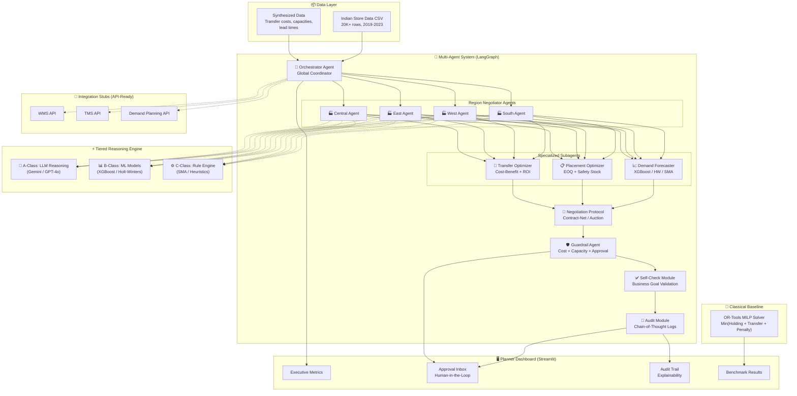
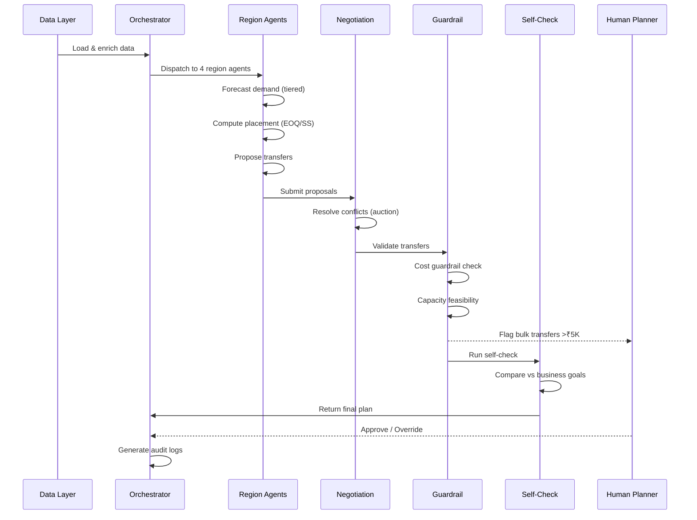

# NetworkIQ — Architecture Diagram

## System Architecture (Mermaid)

```mermaid
graph TB
    subgraph DataLayer["📦 Data Layer"]
        CSV["Indian Store Data CSV<br/>20K+ rows, 2019-2023"]
        SYN["Synthesized Data<br/>Transfer costs, capacities,<br/>lead times"]
    end

    subgraph AgentLayer["🤖 Multi-Agent System (LangGraph)"]
        ORCH["🎯 Orchestrator Agent<br/>Global Coordinator"]
        
        subgraph RegionAgents["Region Negotiator Agents"]
            RA_S["🏭 South Agent"]
            RA_W["🏭 West Agent"]
            RA_E["🏭 East Agent"]
            RA_C["🏭 Central Agent"]
        end
        
        subgraph Subagents["Specialized Subagents"]
            DF["📈 Demand Forecaster<br/>XGBoost / HW / SMA"]
            PO["📋 Placement Optimizer<br/>EOQ + Safety Stock"]
            TO["🔄 Transfer Optimizer<br/>Cost-Benefit + ROI"]
        end
        
        NEG["🤝 Negotiation Protocol<br/>Contract-Net / Auction"]
        GR["🛡️ Guardrail Agent<br/>Cost + Capacity + Approval"]
        SC["✅ Self-Check Module<br/>Business Goal Validation"]
        AUD["📝 Audit Module<br/>Chain-of-Thought Logs"]
    end

    subgraph TieredReasoning["⚡ Tiered Reasoning Engine"]
        LLM["🧠 A-Class: LLM Reasoning<br/>(Gemini / GPT-4o)"]
        ML["📊 B-Class: ML Models<br/>(XGBoost / Holt-Winters)"]
        RULE["⚙️ C-Class: Rule Engine<br/>(SMA / Heuristics)"]
    end

    subgraph UILayer["🖥️ Planner Dashboard (Streamlit)"]
        DASH["Executive Metrics"]
        INBOX["Approval Inbox<br/>Human-in-the-Loop"]
        AUDIT_UI["Audit Trail<br/>Explainability"]
        BENCH_UI["Benchmark Results"]
    end

    subgraph IntegrationLayer["🔌 Integration Stubs (API-Ready)"]
        WMS["WMS API"]
        TMS["TMS API"]
        DPS["Demand Planning API"]
    end

    subgraph BaselineLayer["📐 Classical Baseline"]
        MILP["OR-Tools MILP Solver<br/>Min(Holding + Transfer + Penalty)"]
    end

    CSV --> ORCH
    SYN --> ORCH
    ORCH --> RA_S & RA_W & RA_E & RA_C
    RA_S & RA_W & RA_E & RA_C --> DF & PO & TO
    DF & PO & TO --> NEG
    NEG --> GR
    GR --> SC
    SC --> AUD
    AUD --> INBOX
    
    RA_S & RA_W & RA_E & RA_C -.-> LLM & ML & RULE
    
    ORCH --> DASH
    GR --> INBOX
    AUD --> AUDIT_UI
    MILP --> BENCH_UI
    
    ORCH -.-> WMS & TMS & DPS
```

## Data Flow

```mermaid
sequenceDiagram
    participant D as Data Layer
    participant O as Orchestrator
    participant R as Region Agents
    participant N as Negotiation
    participant G as Guardrail
    participant S as Self-Check
    participant H as Human Planner
    
    D->>O: Load & enrich data
    O->>R: Dispatch to 4 region agents
    R->>R: Forecast demand (tiered)
    R->>R: Compute placement (EOQ/SS)
    R->>R: Propose transfers
    R->>N: Submit proposals
    N->>N: Resolve conflicts (auction)
    N->>G: Validate transfers
    G->>G: Cost guardrail check
    G->>G: Capacity feasibility
    G-->>H: Flag bulk transfers >₹5K
    G->>S: Run self-check
    S->>S: Compare vs business goals
    S->>O: Return final plan
    H-->>O: Approve / Override
    O->>O: Generate audit logs
```
